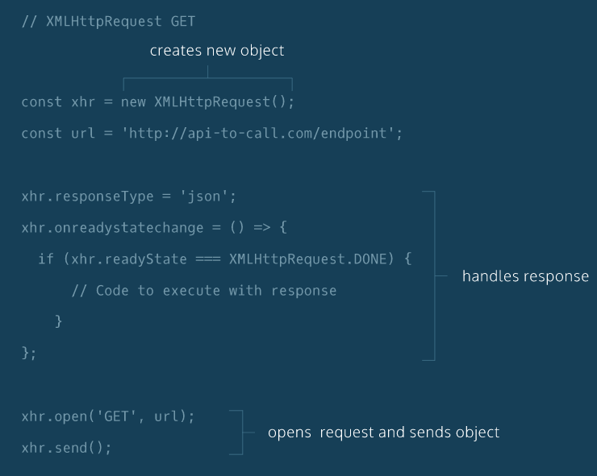
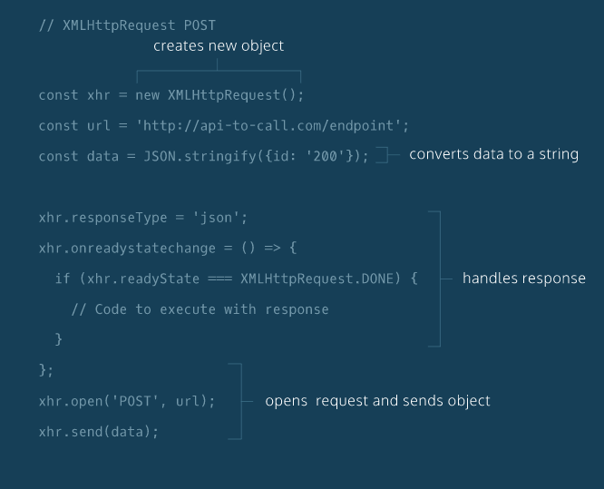

## Requests (PART 1)
- There are many types of HTTP requests. The four most commonly used types of
HTTP requests are GET, POST, PUT, and DELETE. In this lesson, we’ll cover GET
and POST requests. If you want to learn more about the different HTTP requests,
we recommend the following documentation:
[Mozilla Developer Network: HTTP methods](https://developer.mozilla.org/en-US/docs/Web/HTTP/Methods)

- With a GET request, we’re retrieving, or getting, information from some
source (usually a website). For a POST request, we’re posting information to a
source that will process the information and send it back.

- You can make GET and POST requests by using JavaScript’s XHR object. We’ll
also incorporate query strings into our requests.

- One of JavaScript’s greatest assets is its non-blocking properties, or that it is an asynchronous language.

- JavaScript uses an event loop to handle asynchronous function calls. When a
program is run, function calls are made and added to a stack. The functions that
make requests that need to wait for servers to respond then get sent to a
separate queue. Once the stack has cleared, then the functions in the queue
are executed.

- Web developers use the event loop to create a smoother browsing experience
by deciding when to call functions and how to handle asynchronous events.
One system of technologies called **Asynchronous JavaScript and XML, or AJAX**.
To read more about the event loop, read the MDN documentation:
[MDN Documentation: Event Loop](https://developer.mozilla.org/en-US/docs/Web/JavaScript/EventLoop)

### XHR GET Requests I
- Asynchronous JavaScript and XML (AJAX), enables requests to be made after the
initial page load. Initially, AJAX was used only for XML formatted data, now it
can be used to make requests that have many different formats.
[MDN Documentation: Extensible Markup Language (XML)](https://developer.mozilla.org/en-US/docs/Web/XML/XML_introduction)
- Similarly, the XMLHttpRequest (XHR) API, named for XML, can be used to make
many kinds of requests and supports other forms of data.
- The purpose of this conditional statement below checks to see if the request has finished.
```javascript
if (xhr.readyState === XMLHttpRequest.DONE) {

}
```
- The basic boilerplate is shown below:
```javascript
const xhr = new XMLHttpRequest();
const url = "https://api-to-call.com/endpoint";

xhr.responseType = 'json';
xhr.onreadystatechange = () => {
  if(xhr.readyState === XMLHttpRequest.DONE){
		return xhr.response;
  }
};

xhr.open('GET', url);
xhr.send();
```


### XHR GET Requests II
-  A query string contains additional information to be sent with a request.
Usually APIs allow us to retrieve more specific data with query strings attached to the request URL.
[Wiki: query string](https://en.wikipedia.org/wiki/Query_string)
A query string is separated from the URL using a '?' character. After '?', you
can then create a parameter which is a key value pair joined by a '='.
- If you want to add an additional parameter you will have to use the '&' character to separate your parameters.

### XHR POST Requests I
- The major difference between a GET request and POST request is that a POST request requires additional information to be sent through the request. This additional information is sent in the body of the post request.

- JSON.stringify() will convert a value to a JSON string. By converting the
value to a string, we can then send the data to a server.

### Important Bulletpoints
1. JavaScript is the language of the web because of its asynchronous capabilities.
AJAX, which stands for Asynchronous JavaScript and XML, is a set of tools that
are used together to take advantage of JavaScript’s asynchronous capabilities.

2. There are many HTTP request methods, two of which are GET and POST.

3. GET requests only request information from other sources.

4. POST methods can introduce new information to other sources in addition to requesting it.

5. GET requests can be written using an XMLHttpRequest object and vanilla JavaScript.

6. POST requests can also be written using an XMLHttpRequest object and vanilla JavaScript.

7. Writing GET and POST requests with XHR objects and vanilla JavaScript requires
constructing the XHR object using new, setting the responseType, creating a function
that will handle the response object, and opening and sending the request.

8. To add a query string to a URL endpoint you can use ? and include a parameter.

9. To provide additional parameters, use & and then include a key-value pair, joined by =.

10. Determining how to correctly write the requests and how to properly implement them requires carefully reading the documentation of the API with which you’re working.
