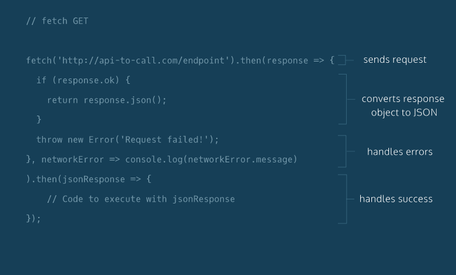
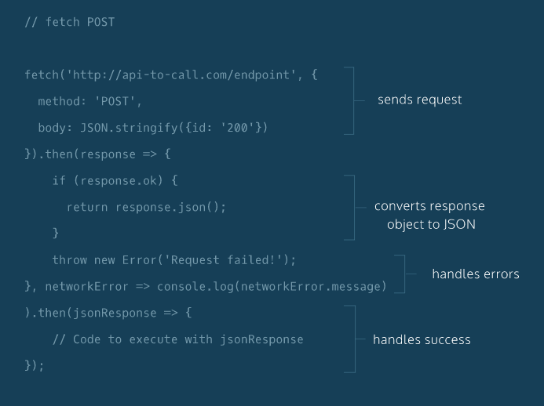
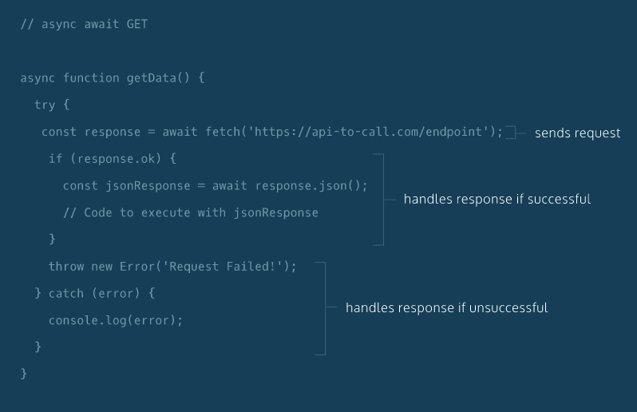
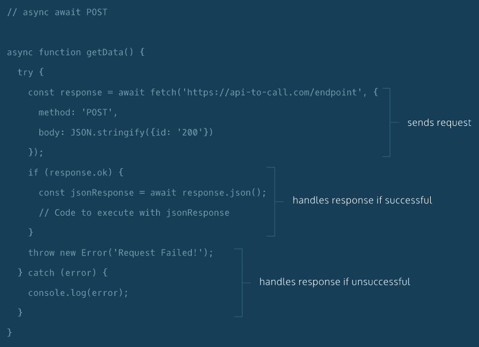

## Requests (PART 2)
- To make asynchronous event handling easier, **promises** were introduced in JavaScript in ES6:
    - [Mozilla Development Network: Promises](https://developer.mozilla.org/en-US/docs/Web/JavaScript/Reference/Global_Objects/Promise)
- A promise is an object that handles asynchronous data. A promise has three states:
    - pending : when a promise is created or waiting for data.
    - fulfilled : the asynchronous operation was handled successfully.
    - rejected : the asynchronous operation was unsuccessful.
The great thing about promises is that once a promise is fulfilled or rejected,
you can *chain* an additional method to the original promise.

- **fetch()**, which uses promises to handle requests. The fetch function:
    - Creates a request object that contains relevant information that an API needs.
    - Sends that request object to the API endpoint provided.
    - Returns a promise that ultimately resolves to a response object, which contains the status of the promise with information the API sent back.
The basic boilerplate as shown:
```javascript
fetch('https://api-to-call.com/endpoint').then((response) => {
  if(response.ok){
    return response.json();
  }
  throw new Error('Request failed!');
}, (networkError) => {
  console.log(networkError.message);
}).then((jsonResponse) => {
  return jsonResponse;
});
```

- Here is the boilerplate for Fetch POST:
```javascript
fetch('https://api-to-call.com/endpoint', {
  method: 'POST',
  body: JSON.stringify({id:'200'})
}).then((response) =>{
   if(response.ok){
     return response.json();
   }
  throw new Error('Request failed!');
}, (networkError) =>{
	console.log(networkError.message);
}).then((jsonResponse) =>{
  return jsonResponse;
});
```


- Chaining Promises and making it simpler can be achieved with using functionality
introduced in ES8: **async** and **await**.

    - Using an async function will return a promise.
    - *await* can only be used in an async function. await allows a program to
    run while waiting for a promise to resolve.
    - In a try...catch statement, code in the try block will be run and in the
    event of an exception/error, the code in the catch statement will run.
- BOILERPLATE FOR GET:
```javascript
const getData = async () => {
  try{
    const response = await fetch('https://api-to-call.com/endpoint');
    if(response.ok){
			const jsonResponse = await response.json();
      return jsonResponse;
    }
    throw new Error('Request failed!');
  } catch(error) {
    console.log(error);
  }
};
```

- - BOILERPLATE FOR POST:
```javascript
const getData = async () => {
  try{
    const response = await fetch('https://api-to-call.com/endpoint', {
      method: 'POST',
      body: JSON.stringify({id: 200})
    });
    if(response.ok){
			const jsonResponse = await response.json();
      return jsonResponse;
    }
    throw new Error('Request failed!');
  }catch(error){
		console.log(error);
  }
};
```
## RECAP
1. GET and POST requests can be created a variety of ways.

2. Use AJAX to asynchronously request data from APIs. fetch() and async/await
are new functionalities developed in ES6 (promises) and ES8 respectively.

3. Promises are a new type of JavaScript object that represent data that will
eventually be returned from a request.

4. fetch() is a web API that can be used to create requests. fetch() will return promises.

5. We can chain .then() methods to handle promises returned by fetch().

6. The .json() method converts a returned promise to a JSON object.

7. async is a keyword that is used to create functions that will return promises.

8. await is a keyword that is used to tell a program to continue moving through
the message queue while a promise resolves.

9. await can only be used within functions declared with async.
